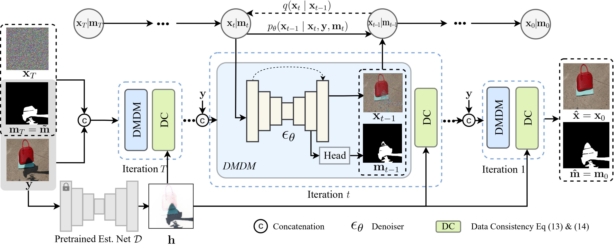
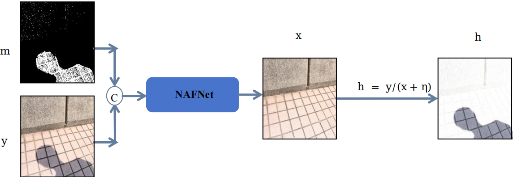
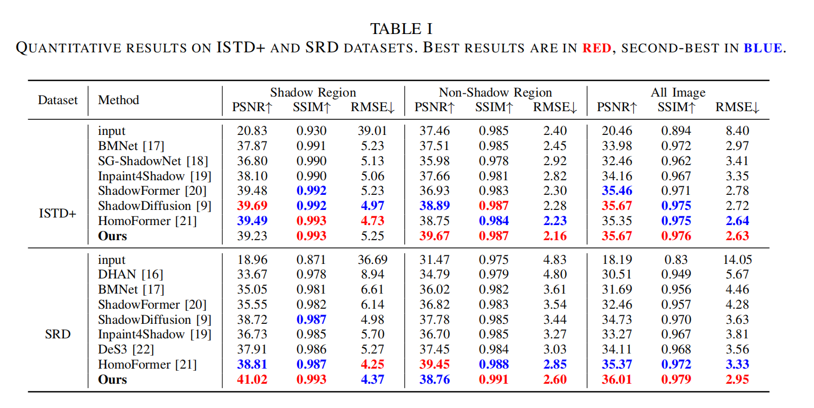
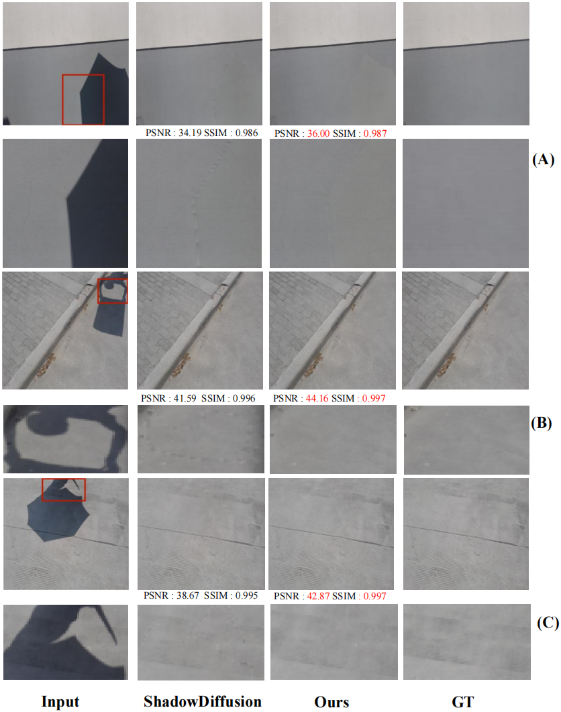

# [APSIPA ASC 2025] An improved method for Image Shadow Removal by Combining Deterministic and Stochastic Models

## Introduction

ShadowDiffusion addresses shadow removal by proposing a unified diffusion framework, dubbed ShadowDiffusion, that integrates both the image and degradation priors for highly effective shadow removal. ShadowDiffusion progressively refines the estimated shadow mask as an auxiliary task of the diffusion generator, which leads to more accurate and robust shadow-free image generation. For more details, please refer to our [original paper](https://arxiv.org/pdf/2212.04711.pdf).

To improve both efficiency and effectiveness, we propose two key contributions: (1) integrating the Nonlinear Activation Free Network (NAFNet) as the degradation prior within the diffusion framework. This combines NAFNet’s efficient deterministic modeling with the stochastic generative capacity of diffusion models, leveraging their complementary strengths for high-quality, detail-preserving reconstructions. (2) optimizing the penalty parameter in the unrolling process, yielding improved restoration quality without additional training cost. Our improved model, ShadowDiffusion+, is evaluated on two public shadow removal datasets. On the SRD dataset, it improves PSNR from 34.73 dB to 36.01 dB and SSIM from 0.970 to 0.979, demonstrating both accuracy and efficiency.

ShadowDiffusion framework:
<p align=center></p>
NAFNet framework as estimtetion network:
<p align=center></p>


## Requirement

- Python 3.7
- Pytorch 1.7
- CUDA 11.1

```bash
pip install -r requirements.txt
```

## Datasets

- ISTD+ [[link]](https://github.com/cvlab-stonybrook/SID)
- SRD [[Training]](https://drive.google.com/file/d/1W8vBRJYDG9imMgr9I2XaA13tlFIEHOjS/view)[[Testing]](https://drive.google.com/file/d/1GTi4BmQ0SJ7diDMmf-b7x2VismmXtfTo/view)
  [[Mask]](https://uofmacau-my.sharepoint.com/personal/yb87432_um_edu_mo/_layouts/15/onedrive.aspx?id=%2Fpersonal%2Fyb87432%5Fum%5Fedu%5Fmo%2FDocuments%2Fghost%2Dfree%2Dshadow%2Dremoval%2Fsrd%5Fmask%2Ezip&parent=%2Fpersonal%2Fyb87432%5Fum%5Fedu%5Fmo%2FDocuments%2Fghost%2Dfree%2Dshadow%2Dremoval&ga=1)
  (detected by [DHAN](https://github.com/vinthony/ghost-free-shadow-removal))

## Pretrained NAFNet

[[Link]](https://drive.google.com/file/d/1CdERsA8x5SAbNJXFOQx0EtAjUFI33pBM/view?usp=sharing)

## Pretrained diffsuion

[[Link]](https://drive.google.com/file/d/12VV5HzxlIg_kCjMHsw8R9n543wYfGfAB/view?usp=sharing)

Please download the corresponding pretrained model and modify the `resume_state` and `degradation_model_path` (optional) in `shadow.json`.

## Test

You can directly test the performance of the pre-trained model as follows

1. Modify the paths to dataset and pre-trained model. You need to modify the following path in the `shadow.json`

```python
resume_state # pretrain model or training state -- Line 12
dataroot # validation dataset path -- Line 30
```

2. Test the model

```python
python sr.py -p val -c config/shadow_SRD.json
```

We use the DDIM sampling to speed up the inference stage. The number of steps can be set by `T_sampling` as 5 or 25.

## Train

1. Download datasets and set the following structure

```
|-- SRD_Dataset
    |-- train
        |-- train_A # shadow image
        |-- train_B # shadow mask
        |-- train_C # shadow-free GT
    |-- test
        |-- test_A # shadow image
        |-- test_B # shadow mask
        |-- test_C # shadow-free GT
```

2. You need to modify the following terms in `option.py`

```python
"resume_state": null # if train from scratch
"dataroot"   # training and testing set path
"gpu_ids": [0] # Our model can be trained using a single RTX A5000 GPU. You can also train the model using multiple GPUs by adding more GPU ids in it.
```

3. Train the diffsuion network

```python
python sr.py -p train -c config/shadow.json
```

4. Train the NAFNet network

```python
python train_NAFNet.py -p train -c config/shadow.json --dataset SRD
```

## Evaluation

The results reported in the paper are calculated by the `matlab` script used in [previous method](https://github.com/zhuyr97/AAAI2022_Unfolding_Network_Shadow_Removal/tree/master/codes). Details refer to evaluation.m.

## Results
<p align=center></p>

## Visual results
<p align=center></p>


## Reference

[CVPR 2023] ShadowDiffusion: When Degradation Prior Meets Diffusion Model for Shadow Removal [[Paper]](https://arxiv.org/pdf/2212.04711.pdf)

**ShadowDiffusion: When Degradation Prior Meets Diffusion Model for Shadow Removal**
<br>_Lanqing Guo, Chong Wang, Wenhan Yang, Siyu Huang, Yufei Wang, Hanspeter Pfister, Bihan Wen_<br>
In CVPR'2023

## Citation
Hongjun Sheng,&nbsp;Lanqing Guo,&nbsp;Xinggan Peng,&nbsp;Zhiping Lin and&nbsp;Bihan Wen,  "An improved method for Image Shadow Removal by Combining Deterministic and Stochastic Models",  Asia Pacific Signal and Information Processing Association Annual Summit and Conference (APSIPA ASC) 2025.  [[Link]](https://ieeexplore.ieee.org/document/11249409)
